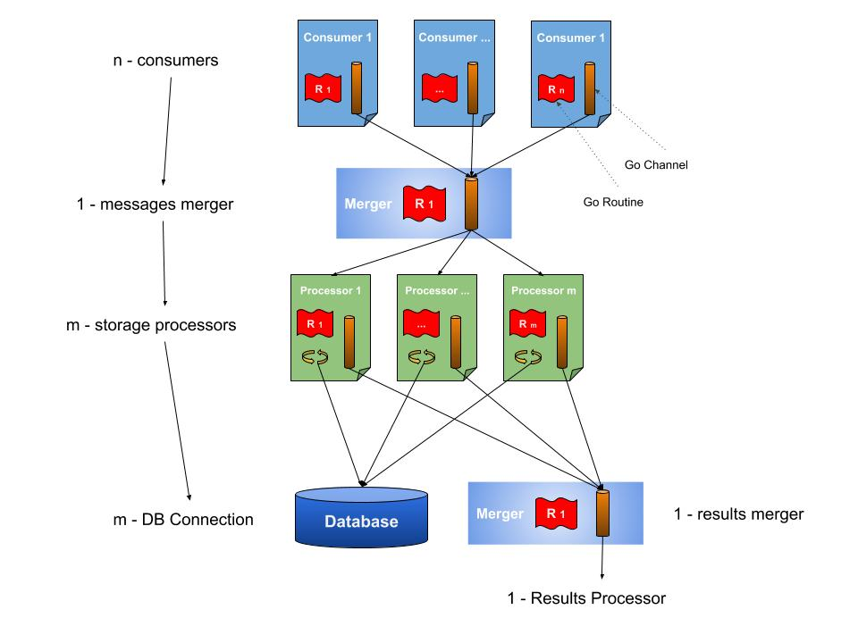

# mq-to-db (message queue to database)


[](https://goreportcard.com/report/github.com/christiangda/mq-to-db)


This is a [Golang (go)](https://golang.org/) program to read [a specific JSON Payload message](docs/messages.md) from a Message Queue System and Store into Database using concurrency

This is a close image of how it works:



## Consumers supported

* [RabbitMQ](https://www.rabbitmq.com/)

## Storage supported

* [PostgreSQL](https://www.postgresql.org/)

## Characteristics

* The number of queue consumers could be different from the numbers of storage workers
* The process (job) of consuming one message from the queue and store into the database is synchronous because every message needs to be acknowledged (confirm as storage).
* Golang `pprof` enabled via `--profile` command line when starting the service
* Prometheus metrics for consumers, storage workers, go statistics, and database.
* Grafana dashboard for prometheus metrics
* Dockerfile multi-stage build
* Makefile to facilitate the project builds
* docker-compose file and configuration to testing all elements
* docker images at [docker-hub](https://hub.docker.com/repository/docker/christiangda/mq-to-db)
* [CI/CD Github Action pipeline](https://github.com/christiangda/mq-to-db/actions) workflow

## How to execute

There are many ways to do it, but always is necessary `PostgreSQL` and `RabbitMQ` dependencies, but the easy way to see how it works is using containers.

### docker-compose

The program and all dependencies and visibility systems at once

#### Up

```bash
docker-compose up --build
```

#### Down

```bash
docker-compose down -v
```

#### Available links

After docker-compose start all the services, you have the following links ready to be curious, I prepared a simple `grafana dashboard` tok show you part of the `prometheus metrics` implemented

* [mq-to-db-01 home page](http://localhost:8080/)
* [mq-to-db-02 home page](http://localhost:8081/)
* [Prometheus Dashboard](http://localhost:9090/)
* [Grafana Dashboard](http://localhost:3000/)
* [RabbitMQ Dashboard](http://localhost:15672/)

### Manually

First install dependencies

#### RabbitMQ

```bash
docker run -it --rm --name rabbitmq -p 5672:5672 -p 15672:15672 rabbitmq:3-management
```

__NOTES:__

* RabbitMQ web console: [http://localhost:15672](http://localhost:15672)
* Username: guest
* Password: guest

#### PostgreSQL

```bash
docker run --rm  --name postgresql -e POSTGRES_PASSWORD=mysecretpassword -p 5432:5432 -d postgres

# logs
docker logs postgresql -f

# remember to  stop and remove (--rm in docker run do it for you)
docker stop postgresql
```

### Using source code

```bash
git clone https://github.com/christiangda/mq-to-db.git
cd mq-to-db/
go run -race  ./cmd/mq-to-db/main.go --help

# and then
go run -race  ./cmd/mq-to-db/main.go --configFile config-sample.yaml
```

__NOTE:__ the parameter `-race`is to check [race conditions](https://blog.golang.org/race-detector) because we are using [Go Concurrency](https://blog.golang.org/pipelines)

### Using binary

Linux only

```bash
# make executable first
make

# check the available options
./mq-to-db --help

# execute
./mq-to-db --configFile config-sample.yaml
```

__NOTES:__

* Remember to start dependencies first

### Available endpoints

The application expose different endpoints via http server

* [http://localhost:8080/](http://localhost:8080/)
* [http://localhost:8080/metrics](http://localhost:8080/metrics)
* [http://localhost:8080/health](http://localhost:8080/health)
* [http://localhost:8080/debug/pprof](http://localhost:8080/debug/pprof)

### Profiling

```bash
# terminal 1, for mq-to-db-01 inside the docker-compose-file
go tool pprof http://127.0.0.1:8080/debug/pprof/goroutine

# terminal 2, for mq-to-db-02 inside the docker-compose-file
go tool pprof http://127.0.0.1:8081/debug/pprof/goroutine


# once you are into tool pprof, execute the command web
(pprof) web
```

### See the Logs

```bash
docker-compose logs mq-to-db-01
docker-compose logs mq-to-db-02
```

## How to build

Manually

```bash
go build \
    -o mq-to-db \
    -ldflags "-X github.com/christiangda/mq-to-db/internal/version.Version=$(git rev-parse --abbrev-ref HEAD) -X github.com/christiangda/mq-to-db/internal/version.Revision=$(git rev-parse HEAD) -X github.com/christiangda/mq-to-db/internal/version.Branch=$(git rev-parse --abbrev-ref HEAD) -X github.com/christiangda/mq-to-db/internal/version.BuildUser=\"$(git config --get user.name | tr -d '\040\011\012\015\n')\" -X github.com/christiangda/mq-to-db/internal/version.BuildDate=$(date +'%Y-%m-%dT%H:%M:%S')" \
    ./cmd/mq-to-db/main.go
```

Automatic

```bash
make
```

__NOTES__ related to make

* 1. This create a linux binary (64bits) and also Docker Image (linux 64 bit)
* 2. Check the [Makefile](Makefile) to see the `The make available targets options`

## References

Internals

* [Configuration](docs/config.md)
* [Messages Type](docs/messages.md)

Externals

* [references](docs/references.md)
  
## License

This module is released under the GNU General Public License Version 3:

* [http://www.gnu.org/licenses/gpl-3.0-standalone.html](http://www.gnu.org/licenses/gpl-3.0-standalone.html)

## Author Information

* [Christian González Di Antonio](https://github.com/christiangda)
